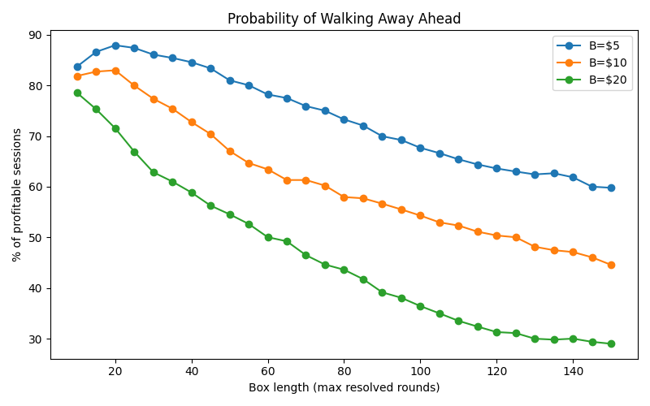

# Two-Up — Time-Boxed Martingale Study

> *“The only fair game in town … unless you double after every loss.”*  
> — Typical ANZAC-Day punter

This repository contains a small Monte-Carlo study that asks:

*Does quitting a Martingale after a fixed number of Two-Up tosses give you a real edge, or just change how the risk shows up?*

The answer is explored for three common stakes (\$5, \$10, \$20) and a wide range of **box lengths** (the quit-after-N-tosses rule).

---

## 1  Background

Two-Up is a 50-50 coin game played in Australia each ANZAC Day:

1. A “kip” (paddle) is flicked to toss two pennies.  
2. **Two Heads ⇢ Win**, **Two Tails ⇢ Lose**, **Odds (one each) ⇢ re-toss**.

A **Martingale** doubles the wager after every loss and resets to the base stake after a win.  
Because bankrolls and table limits are finite, sooner or later the system hits a streak it cannot cover and goes bust.

**Time-boxing** (e.g. “leave after 75 resolved tosses”) shuts the game down early.  
The trade-off becomes:

| Short box | Long box |
|-----------|----------|
| High probability of a small win | Low probability of a huge win |
| Tiny bust risk | Larger bust risk |

---

## 2  Methodology

| Parameter | Values / Range |
|-----------|----------------|
| Initial bankroll | \$1 000 |
| Base stake **B** | \$5, \$10, \$20 |
| Box length **N** (max rounds) | 10 → 150 |
| Loss multiplier | 2.0 (classic Martingale) |
| Coin bias | Fair (p = 0.5) |
| Trials per (B, N) | 20 000 Monte-Carlo sessions |

For every (B, N) pair the script records:

* Mean / median final bankroll  
* Probability of finishing ahead  
* Bust rate  
* Average win size (conditional) & average loss size (conditional)

---

## 3  Results

### 3 .1  Probability of walking away ahead (coarse grid)

*Short boxes give a high hit-rate but the curve decays rapidly as you allow more tosses.*

### 3 .2  Fine-grid table (B = $5)

| Box length | % ahead | Typical profit (if ahead) | Bust-rate % |
|-----------:|-------:|---------------------------:|------------:|
| 10  | **83.71** | 23.41 | 0.000 |
| 15  | 86.61 | 34.91 | 0.000 |
| 20  | 87.92 | 46.47 | 0.000 |
| 25  | 87.40 | 58.81 | 0.000 |
| 30  | 86.08 | 71.31 | 0.000 |
| 35  | 85.42 | 82.73 | 0.000 |
| 40  | 84.58 | 94.71 | 0.000 |
| 45  | 83.37 | 107.74 | 0.000 |
| 50  | 81.01 | 120.15 | 0.000 |
| 55  | 80.04 | 132.64 | 0.000 |
| 60  | 78.21 | 145.34 | 0.000 |
| 65  | 77.50 | 157.31 | 0.000 |
| 70  | 75.91 | 169.67 | 0.000 |
| 75  | 75.01 | 181.95 | 0.000 |
| 80  | 73.29 | 194.92 | 0.000 |
| 85  | 72.08 | 207.31 | 0.000 |
| 90  | 69.97 | 220.45 | 0.000 |
| 95  | 69.23 | 232.45 | 0.010 |
| 100 | 67.68 | 245.44 | 0.010 |
| 105 | 65.63 | 257.84 | 0.045 |
| 110 | 65.42 | 270.14 | 0.065 |
| 115 | 64.44 | 283.72 | 0.135 |
| 120 | 63.60 | 296.88 | 0.185 |
| 125 | 62.44 | 321.44 | 0.230 |
| 130 | 62.07 | 333.99 | 0.230 |
| 135 | 62.87 | 345.90 | 0.240 |
| 140 | 60.64 | 356.98 | 0.280 |
| 145 | 60.02 | 357.54 | 0.230 |
| 150 | 59.80 | 370.57 | 0.265 |

### 3 .3  Fine-grid table (B = $10)

| Box length | % ahead | Typical profit (if ahead) | Bust-rate % |
|-----------:|-------:|---------------------------:|------------:|
| 10  | **81.86** | 47.51 | 0.000 |
| 15  | 82.72 | 70.90 | 0.000 |
| 20  | 82.98 | 94.53 | 0.000 |
| 25  | 79.97 | 119.09 | 0.000 |
| 30  | 77.37 | 144.48 | 0.000 |
| 35  | 75.41 | 168.18 | 0.000 |
| 40  | 72.78 | 193.18 | 0.000 |
| 45  | 70.40 | 218.40 | 0.010 |
| 50  | 67.63 | 244.08 | 0.050 |
| 55  | 64.68 | 271.29 | 0.145 |
| 60  | 63.44 | 295.73 | 0.290 |
| 65  | 61.33 | 321.26 | 0.365 |
| 70  | 59.23 | 345.24 | 0.430 |
| 75  | 60.23 | 369.58 | 0.490 |
| 80  | 57.97 | 394.74 | 0.540 |
| 85  | 57.72 | 421.15 | 0.535 |
| 90  | 56.66 | 446.96 | 0.520 |
| 95  | 55.53 | 472.34 | 0.475 |
| 100 | 54.32 | 496.46 | 0.500 |
| 105 | 53.28 | 521.98 | 0.515 |
| 110 | 52.34 | 548.07 | 0.540 |
| 115 | 51.34 | 572.86 | 0.540 |
| 120 | 50.39 | 598.98 | 0.520 |
| 125 | 50.06 | 622.81 | 0.485 |
| 130 | 48.16 | 647.78 | 0.465 |
| 135 | 47.48 | 672.99 | 0.490 |
| 140 | 47.12 | 698.60 | 0.460 |
| 145 | 46.08 | 724.12 | 0.525 |
| 150 | 44.59 | 748.94 | 0.455 |

### 3 .4  Fine-grid table (B = $20)

| Box length | % ahead | Typical profit (if ahead) | Bust-rate % |
|-----------:|-------:|---------------------------:|------------:|
| 10  | **78.54** | 95.99  | 0.000 |
| 15  | 75.31 | 144.57 | 0.000 |
| 20  | 71.55 | 192.57 | 0.000 |
| 25  | 66.94 | 244.25 | 0.125 |
| 30  | 62.86 | 295.92 | 0.535 |
| 35  | 61.02 | 344.50 | 0.860 |
| 40  | 58.87 | 394.01 | 1.045 |
| 45  | 56.28 | 445.34 | 1.015 |
| 50  | 54.56 | 498.51 | 1.000 |
| 55  | 52.66 | 550.50 | 1.010 |
| 60  | 49.24 | 600.22 | 1.060 |
| 65  | 49.24 | 648.18 | 0.870 |
| 70  | 46.50 | 697.03 | 1.000 |
| 75  | 44.65 | 751.47 | 1.035 |
| 80  | 43.64 | 804.64 | 0.805 |
| 85  | 41.78 | 852.57 | 0.970 |
| 90  | 39.17 | 904.58 | 1.085 |
| 95  | 38.09 | 956.83 | 0.995 |
| 100 | 36.42 | 1 009.79 | 1.025 |
| 105 | 35.02 | 1 058.98 | 1.010 |
| 110 | 33.54 | 1 111.37 | 0.970 |
| 115 | 32.40 | 1 161.16 | 1.095 |
| 120 | 31.32 | 1 205.92 | 1.045 |
| 125 | 31.24 | 1 239.78 | 1.195 |
| 130 | 30.01 | 1 258.64 | 1.080 |
| 135 | 29.84 | 1 276.83 | 1.090 |
| 140 | 30.03 | 1 285.43 | 1.065 |
| 145 | 29.82 | 1 287.77 | 1.040 |
| 150 | 29.02 | 1 298.33 | 1.155 |

---

## 4  Discussion

* **Short boxes (≤ 50 tosses)**  
  *70 – 85 %* of sessions end positive, but median profit is coffee-money (tens of dollars).  
* **Middle boxes (~75 – 100 tosses)**  
  Win-rate slides to ~60 – 70 %; typical wins hit \$200 – \$300; bust risk first appears (< 1 %).  
* **Long boxes (≥ 135 tosses)**  
  Upside grows past \$300 but probability of profit falls below 60 % and bust risk climbs sharply.

Overall expected value remains near \$0 (fair game) — any “edge” is manufactured by the stop-time and shows up as variance, not free money.

---

## 5  Conclusion

* A **time-boxed Martingale can make you feel like a winner** if you’re happy to quit early for small gains.  
* Extending the session **quickly erodes that comfort** in exchange for a shot at much larger (but rarer) payouts.  
* **Bust remains an ever-present tail risk**; no stop-time can remove it, only postpone it.

In practice, use a small stake and a modest box if you just want the fun of
leaving a few dollars ahead on ANZAC Day. Treat anything bigger as pure
gambling entertainment.

---